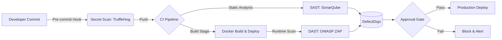

<p align="center">
  
</p>

<h1 align="center">CodeFortress</h1>

<p align="center">
  <b>Production-Grade DevSecOps Pipeline & Vulnerability Scanner</b>
</p>

<p align="center">
  <a href="https://github.com/Sandeep6135/CodeFortress-Pipeline/releases"></a>
  <a href="https://github.com/Sandeep6135/CodeFortress-Pipeline/actions"></a>
  <a href="https://sonarcloud.io/summary/new_code?id=Sandeep6135_CodeFortress-Pipeline"></a>
  <a href="https://github.com/Sandeep6135/CodeFortress-Pipeline/blob/main/LICENSE"></a>
</p>

## 🚀 Overview

**CodeFortress** is an enterprise-ready, automated application security pipeline designed to enforce **Shift-Left Security** across the entire Software Development Life Cycle (SDLC). 

It acts as an impenetrable gatekeeper, orchestrating Secret Scanning, Static Application Security Testing (SAST), and Dynamic Application Security Testing (DAST) into a unified, developer-friendly workflow. CodeFortress guarantees that zero critical vulnerabilities or hardcoded secrets make their way into production.

## ✨ Features

- **Preventative Secret Scanning:** Pre-commit hooks powered by TruffleHog to intercept hardcoded credentials before they are pushed.
- **Automated Security Gates:** Strict CI/CD enforcement that automatically blocks PRs containing Critical or High severity vulnerabilities.
- **Deep Code Inspection (SAST):** Integrated SonarQube analysis to detect XSS, SQLi, CSRF, and logic flaws directly in the codebase.
- **Runtime Attack Simulation (DAST):** Automated OWASP ZAP scans against ephemeral staging environments to catch misconfigurations and run-time vulnerabilities.
- **Unified Threat Dashboard:** Aggregates findings from all scanners into DefectDojo for a single source of truth, eliminating alert fatigue.
- **Developer-First CLI (Beta):** Run the entire security pipeline locally before ever interacting with CI.

## 💻 Demo & Usage

Run CodeFortress locally to audit your codebase instantly.

```bash
$ codefortress scan ./my-app --comprehensive

[+] Initializing CodeFortress Pipeline v1.0.0...
[+] Phase 1: Scanning for exposed secrets... ✓ (0 secrets found)
[+] Phase 2: Analyzing SAST (SonarQube ruleset)... 
    ↳ [WARN] Medium: Insecure use of hashlib.md5() in auth.py:42
[+] Phase 3: Spinning up ephemeral container for DAST... ✓
[+] Phase 4: Executing OWASP ZAP baseline scan...
    ↳ [FAIL] Critical: Missing Anti-CSRF Tokens on /login

==================================================
🛡️  CodeFortress Security Report
==================================================
Total Issues: 2 (1 Critical, 1 Medium, 0 Low)
Status: ❌ FAILED (Critical issues detected)
Report saved to: ./reports/codefortress-run-104.json
```

## 🏗️ Architecture

CodeFortress uses a modular, plug-and-play architecture that can be integrated into any CI/CD platform (Jenkins, GitHub Actions, GitLab CI).



## ⚙️ Installation

**Prerequisites:** Docker, Docker Compose, Git

```bash
# Clone the repository
git clone https://github.com/Sandeep6135/CodeFortress-Pipeline.git
cd CodeFortress-Pipeline

# Install the CodeFortress CLI (Optional, requires Python 3.9+)
pip install -e .

# Stand up the infrastructure (Jenkins, SonarQube, DefectDojo)
docker-compose -f deploy/docker-compose.yml up -d
```
*For detailed setup, see the [Deployment Guide](docs/DEPLOYMENT_GUIDE.md).*

## 🛠️ Tech Stack

| Domain | Technology | Purpose |
|--------|------------|---------|
| **Core CI/CD** | Jenkins / GitHub Actions | Pipeline Orchestration |
| **Secret Scanning** | TruffleHog | Entropy & Regex-based credential detection |
| **SAST** | SonarQube | Multi-language static code analysis |
| **DAST** | OWASP ZAP | Active vulnerability probing |
| **ASPM / Dashboard**| DefectDojo | Vulnerability management and correlation |
| **Infrastructure** | Docker & Compose | Ephemeral environment provisioning |

## 📊 Benchmarks

CodeFortress is optimized for speed, ensuring security doesn't become a bottleneck:

| Phase | Average Time | Context |
|-------|--------------|---------|
| Secret Scan | `< 2s` | Pre-commit local execution (10k LOC) |
| SAST Analysis | `~ 45s` | Pipeline execution (Node.js/Python) |
| DAST Baseline | `~ 3m` | Automated spidering and active scan |
| Total CI Impact | `+ 4m` | Overhead added to standard build pipeline |

## 🤝 Contributing

We welcome contributions from security engineers and developers! 
Please read our [Contributing Guidelines](CONTRIBUTING.md) and [Code of Conduct](CODE_OF_CONDUCT.md) before submitting a Pull Request.

## 🛡️ Security

If you discover a security vulnerability within CodeFortress, please refer to our [Security Policy](SECURITY.md) and report it responsibly.

## 📝 License

Distributed under the MIT License. See `LICENSE` for more information.

---
*Built with 🛡️ for modern DevSecOps teams.*